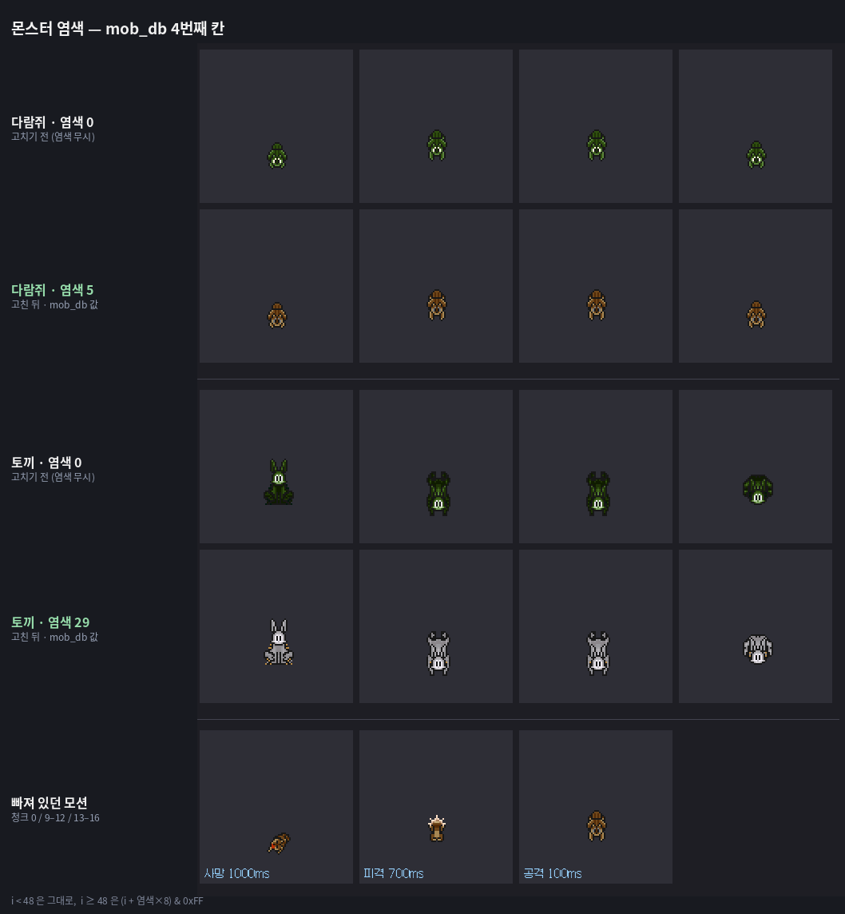
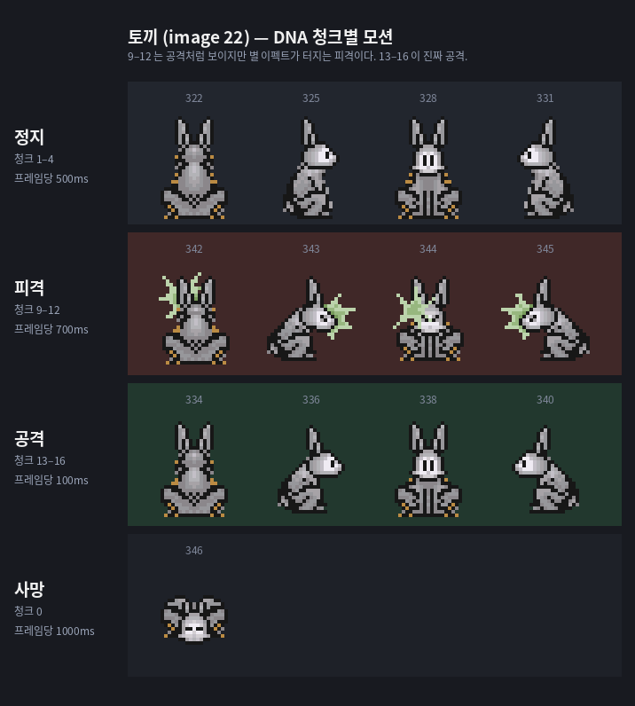
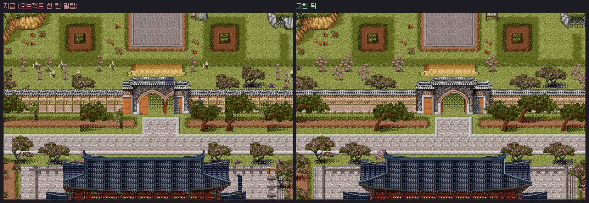
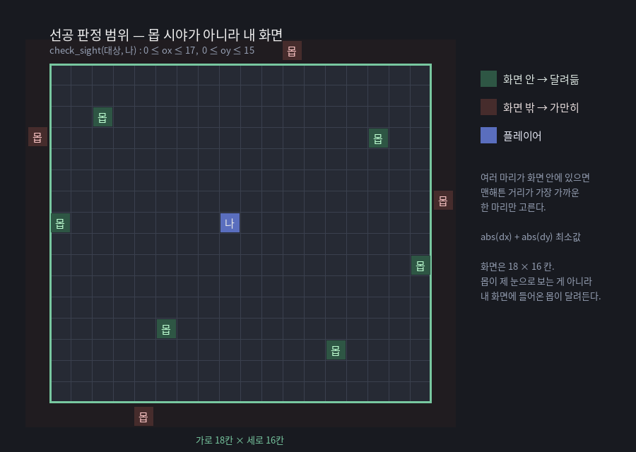

# 원본 리소스 해석 — 검증된 발견 5가지

별도 작업에서 EPF/DNA/PAL/SObj를 직접 디코딩하며 확인한 내용입니다.
현재 `Docs/BaramSource/render.cjs`에 반영되지 않은 것들이라 정리해 둡니다.

---

## 1. 몬스터 염색값은 `mob_db.txt`에 있다 — 지금 무시되고 있음

`mob_db.txt` 4번째 컬럼이 **염색**입니다.

```
//번호  이름   이미지  염색  체력  경험치  방어력  ...
1       다람쥐   26     5     15    10     100
2       토끼     22    29     10     5     100
```

이름이 색을 말해주는 행들이 결정적인 증거입니다.

| 이름 | 이미지 | 염색 |
|---|---:|---:|
| 초록토끼 | 22 | 1 |
| 갈색토끼 | 22 | 4 |
| 붉은토끼 | 22 | 31 |
| 흑토끼 | 22 | 10 |
| 흑다람쥐 | 26 | 10 |

같은 이미지 22번을 쓰면서 색만 다릅니다. 염색 컬럼이 색을 결정한다는 뜻입니다.

**현재 `render.cjs`는 이 값을 안 봅니다.**

```js
// Docs/BaramSource/render.cjs:21
const f = frame(mon['monster.epf'], mp, index, m.pal)
//                                          ^^^^^ DNA의 팔레트 번호만 사용, 염색 미적용
```

`m.pal`은 monster.dna의 팔레트 인덱스입니다. 다람쥐(mobs[25])의 경우 이 값이 **0**이라,
지금 뽑히는 다람쥐 스프라이트는 염색이 안 된 상태입니다. 원작의 그 황갈색이 아닙니다.

---

## 2. 염색 규칙

팔레트를 바꾸는 게 아니라 **인덱스를 미는** 방식입니다.

```
c = mob_db의 염색값 (signed byte)

if (i < 48)  newIndex = i                  // 앞 48색(0x00~0x2F)은 고정
else         newIndex = (i + c * 8) & 0xFF  // 8칸 단위로 이동
color = palette[newIndex]
```

몬스터 팔레트는 48번부터 8색 블록으로 톤이 배열돼 있어서, `c=1`이면 한 블록 옆,
`c=2`면 두 블록 옆 색으로 옮겨집니다. `c`가 signed라 음수면 반대 방향입니다.

`render.cjs`의 `frame()`에 적용한다면:

```js
function frame(epf, pals, index, pal, dye = 0) {
  // ...
  const shift = (dye * 8) & 0xFF;
  for (let i = 0; i < w * h; i++) {
    let c = epf[off + i];
    if (c) {
      if (c >= 48) c = (c + shift) & 0xFF;   // ← 추가
      p.copy(out, i * 4, c * 4, c * 4 + 3);
      out[i * 4 + 3] = 255;
    }
  }
}
```

**검증**: 다람쥐를 `c=0..7`로 전부 뽑아 비교했고, `c=5`가 원작의 황갈색이었습니다.
그 뒤에 `mob_db.txt`를 열어보니 다람쥐 염색값이 정확히 **5**였습니다.



---

## 3. monster.dna 청크 배치 — 공격과 피격이 뒤바뀌기 쉬움

청크 순서는 이렇습니다.

| 청크 | 모션 | 비고 |
|---|---|---|
| 0 | **사망** | 1프레임 1000ms 유지 후 50ms 깜빡임 ×20 |
| 1–4 | 정지 (상/우/하/좌) | 500ms |
| 5–8 | 걷기 (상/우/하/좌) | 프레임당 100ms |
| 9–12 | **피격** | 700ms |
| 13–16 | **공격** | 100ms |

**9–12가 공격처럼 보이지만 피격입니다.** 프레임을 실제로 뽑아 보면 9–12에는
**별이 튀는 이펙트**가 그려져 있습니다. 13–16이 깔끔한 자세(다람쥐가 앞으로 뻗고,
뱀이 머리를 치켜든)이고 이쪽이 공격입니다. 지속시간도 단서입니다 — 맞았을 때 700ms
휘청이고, 공격은 100ms로 짧게 지릅니다.

처음에 9–12를 공격으로 붙였다가, 플레이 중에 "몹이 나를 때릴 때 맞는 모션을 취한다"는
지적을 받고 프레임을 직접 뽑아 보고서야 알았습니다.



피격 줄에만 초록색 별이 터집니다. 공격 줄은 자세만 바뀝니다.

**현재 `render.cjs`는 정지와 걷기만 뽑습니다.**

```js
// Docs/BaramSource/render.cjs:21
const list = [...new Set(m.chunks.slice(1, 9).flat().map(x => x.index))]
//                                  ^^^^^^ 청크 1~8 = 정지 + 걷기만
```

그래서 `BaramCreatureData.Frames`가 12프레임(4방향 × 3포즈)뿐이고,
**사망·피격·공격 모션이 아예 없습니다.** `slice(0, 17)`로 넓히면 전부 들어옵니다.

---

## 4. 캐릭터 가림 — 현재 구조상 불가능

`BaramMapChunk` 오브젝트 레이어가 `OrderInLayer = 10`, 액터가 `100`입니다.
즉 **캐릭터가 항상 오브젝트 위에 그려집니다.** 나무 뒤로 걸어가도 안 가려집니다.

`BaramMaps/Ba000010/import-report.json`의 `limits`에도 이미 적혀 있습니다:

> "Objects below actor, original dynamic occlusion unverified"

원작은 **행 단위로 그립니다.** 위 행부터 내려오면서, 그 행에 앵커된 오브젝트와
그 행에 서 있는 캐릭터를 순서대로 그립니다. 그래서 캐릭터보다 아래 행에 박힌 나무는
캐릭터를 덮고, 위 행에 박힌 나무는 캐릭터 뒤로 갑니다.

960px 청크로는 행 단위를 못 나눕니다. 현실적인 방법은 **오브젝트를 둘로 쪼개는 것**입니다.

- **안 가리는 것** (풀, 길, 바닥 무늬 등 높이 1짜리) → 지금처럼 큰 청크로 유지
- **가리는 것** (나무, 건물 등 `SObj` 높이 2 이상) → 개별 스프라이트 엔티티로 배치하고
  앵커 행에 따라 `z`(또는 `OrderInLayer`)를 매김

높이 2 이상인 오브젝트만 개별 엔티티가 되므로 개수가 감당됩니다. 부여성 기준으로
전체 오브젝트 배치 중 일부이고, 나머지는 청크에 남습니다.

`SObj.tbl` 파싱은 이미 `render.cjs:8`에 있어서 높이(`frames.length`)를 바로 쓸 수 있습니다.

---

## 참고: 타일/오브젝트 디코딩은 맞습니다

`frame()`이 픽셀을 `w*h` 통짜 블록으로 읽고 인덱스 0을 투명으로 처리하는 방식,
정확합니다. 저는 처음에 스텐실 RLE로 접근했다가 두 번 틀렸습니다.

- 1차: 행 끝 종료 바이트를 안 먹어서 **한 줄 걸러 한 줄이 비었음**
- 2차: 건너뛴 픽셀에는 데이터가 없다고 가정 → 행마다 포인터가 밀려 **대각선 줄무늬**

실제로는 건너뛴 픽셀도 블록에서 자리를 차지합니다. 즉 스텐실은 마스크일 뿐이고,
인덱스 0을 투명으로 보는 쪽이 같은 결과이면서 더 간단합니다.

원본 BMP(`epf2bmp.exe` 추출본) 33장과 픽셀 단위로 대조해 확인했고, 그 BMP들에서
투명 영역은 예외 없이 팔레트 0번(0,59,0)이었으며 그 색이 그림 부분에 쓰인 적은
한 번도 없었습니다.


---

## 5. SObj.tbl 파싱이 한 칸씩 밀려 있다 — 모든 맵의 오브젝트가 틀린 그림

`SObj.tbl`의 배치는 이렇습니다.

```
[count u32][ver u8]
엔트리 i = [height u8][frames u16 × height][미상 4바이트][attr u16]   = 7 + 2×height 바이트
```

현재 `render.cjs:8`은 `p=6`에서 시작해 `p+6`을 height로 읽습니다.

```js
let p=6;
for(...){ const n=b[p+6];
  objects.push({flags:b[p+4], directions:b[p+5], frames:...b.readUInt16LE(p+7+j*2)});
  p+=7+n*2; }
```

**오브젝트 0번의 height가 0**이라서, `6+6=12`가 우연히 **오브젝트 1번의 height 위치**와 딱 겹칩니다.
그래서 `objects[i]`에 **오브젝트 i+1의 프레임**이 들어갑니다. 맵 전체가 한 칸씩 밀린 그림을 그립니다.

거기다 `flags`와 `directions`는 **그 앞 엔트리의 꼬리 6바이트**에서 읽힙니다. 한 레코드 안에서
프레임과 플래그가 서로 다른 오브젝트 것입니다.

### 확인

부여성(`Ba000014`) 기준으로 두 파싱을 비교했습니다.

| | 결과 |
|---|---|
| 맵14가 쓰는 오브젝트 | 736종 |
| 프레임 목록 일치 | **0종** |
| 패턴 | `objects[i]` = 실제 오브젝트 `i+1` |

렌더 결과 비교(`Docs/BaramSource/Assets/map14-*.png` 대 올바른 파싱):

| 레이어 | 다른 픽셀 |
|---|---|
| ground | 361 / 13,118,976 (0.00%) |
| objects | **5,047,959 / 13,118,976 (38.5%)** |

지형은 멀쩡하고 오브젝트만 틀립니다. 파싱 문제라는 게 여기서 확실해집니다.



### 고친 코드

```js
// 엔트리 = [height u8][frames u16 × height][미상 4바이트][attr u16]
let p=5;const objects=[];
for(let i=0;i<tile['sobj.tbl'].readUInt32LE(0);i++){
  const b=tile['sobj.tbl'],n=b[p];
  objects.push({
    height:n,
    frames:Array.from({length:n},(_,j)=>b.readUInt16LE(p+1+j*2)),
    attr:b.readUInt16LE(p+5+n*2)
  });
  p+=7+n*2;
}
```

고친 파싱으로 부여성 오브젝트를 다시 렌더해서 독립 구현(Python)과 대조한 결과
**13,118,976 픽셀 중 159개**만 달랐습니다(팔레트 경계 반올림 수준).

`flags`/`directions`는 위 구조에서 `attr` u16 하나로 잡힙니다. 상·하위 바이트가 각각
무엇인지는 아직 확인 못 했으니, 쓰실 때 값을 먼저 찍어보시는 게 좋겠습니다.

---

## 6. 에뮬레이터 소스에서 확인한 몹 AI — 지금 구현과 여러 군데 다릅니다

v10 에뮬레이터 서버 소스(`RQSGame/mob.c`, `object.c`)를 읽고 확인한 내용입니다.
주석이 상세하게 달려 있어 "왜 그렇게 했는지"까지 나옵니다.

### 6.1 `mob_db` 속성 비트

```
1 안움직임  /  2 선제공격  /  4 공격안함  /  8 도망감  /  32 스크립트
```

**비트 플래그**입니다. 한 몹이 "안움직임 + 선제공격"일 수 있습니다(포탑형 — 자리는
안 뜨는데 옆에 붙으면 때립니다).

에뮬 내부 enum은 `2`와 `4`가 뒤집혀 있고 스크립트가 `16`이라, 표 값을 그대로 쓰면
선공 몹이 가만히 있고 안 덤비는 몹이 달려듭니다. `mob_ai_convert()`가 변환합니다.
**우리는 표 값(위 줄)을 기준으로 삼으면 됩니다.**

`도망감`은 체력이 10 미만일 때만 동작합니다 (`obj->last_gage < 10`).

### 6.2 AI 한 틱 = `mob_db` 이동속도(ms)

```c
return obj->db->speed;   // mob_ai 의 마지막 줄
```

이동과 공격이 별도 루프가 아닙니다. **한 틱에 둘 중 하나**만 일어납니다.

공격 간격만 따로 있습니다 — `mob_db` **17번째 칸(공격속도)**, ms 단위.
`speed`보다 작게 넣어도 더 빨라지지 않고 **최소 간격**으로만 작동합니다.

### 6.3 선공 판정은 몹 시야가 아니라 **플레이어 화면**

```c
seen = check_sight(&obj->loc, &a->od->loc);   // (대상, 나)
```

주석 그대로 "**내가 대상의 화면에 들어와 있냐**"입니다. 몹이 나를 보는 게 아니라,
**내 화면 안에 몹이 들어왔을 때** 몹이 달려듭니다. 화면 밖에서 몹이 튀어나오는 걸
막는 설계입니다.

```c
return ((ox >= 0) && (ox <= 17)) && ((oy >= 0) && (oy <= 15));   // 18 × 16 칸
```



그 안에서 **맨해튼 거리 최근접** 한 마리를 고릅니다.

`vision`(몹 눈길)은 7버전 `set_mobvision`으로 들어온 확장이고 클래식 동작이 아닙니다.

### 6.4 후공 배회 리듬

```c
if (rand() % 2 == 0) { 4방향 중 랜덤으로 방향 전환 }
object_walk(obj);
```

**매 틱 50% 확률로 방향을 바꾸고, 그와 무관하게 항상 한 칸 걷기를 시도합니다.**
방향을 안 바꾸면 계속 직진합니다. 원작 몹 특유의 우물쭈물하는 움직임이 이것입니다.

### 6.5 쫓기 경로 — L자 지그재그의 정체

```c
int side[4] = { UP, RIGHT, DOWN, LEFT };
if (dx > 0)                                         { side[1]=LEFT; side[3]=RIGHT; }  // 타겟이 왼쪽
if (dy < 0)                                         { side[0]=DOWN; side[2]=UP;    }  // 타겟이 아래
if (dy == 0 || (내방향%2 == side[0]%2 && dx != 0))  { swap(0,1); swap(2,3); }
for (i = 0; i < 4; i++)
    if (그쪽으로 갈 수 있으면) { 방향 틀고 한 칸 걷고 return 0; }
```

목표 방향 둘을 먼저 시도하고, 막히면 반대쪽까지 4방향 전부 봅니다.
세 번째 조건(**지금 내 방향과 같은 축이면 축을 바꾼다**)이 몹이 대각선으로 붙을 때
계단처럼 꺾는 이유입니다.

공격은 **맨해튼 거리 1**일 때. 쫓기와 공격이 같은 틱에 일어나므로,
붙는 순간 바로 때립니다 — 뜸을 들이지 않습니다.

### 6.6 그 외

| 항목 | 내용 |
|---|---|
| 어그로표 | 8칸. 초당 감쇠(`_THREAT_DECAY_`), 넘치면 최저값을 밀어냄 |
| 플레이어 사망 | 근처 몹 원한표에서 그 사람을 지움 — 부활 직후 다시 안 물림 |
| 시체 | `mob_corpse_ms` 동안 남았다가 제거 |
| 마비 | 그 틱을 통째로 건너뜀 (타이머는 계속 돎) |
| `mobspawn` 간격 | **초** 단위 (ms 아님) |

**피격 경직은 서버 코드에 없습니다.** DNA의 700ms는 순수 연출이고,
맞아도 몹의 행동은 멈추지 않습니다.

### 6.7 우리 구현과 다른 점

| | 지금 우리 | 원작 |
|---|---|---|
| AI 타입 | `wander`/`aggro`/`static`/`spin` 배타 선택 | 비트 플래그 조합 |
| `spin` | 있음 | **원작에 없음** (내가 만든 것) |
| `도망감` | 없음 | 체력 10 미만에서 동작 |
| 선공 범위 | 임의 반경 | 플레이어 화면 18×16 |
| 배회 | 매 틱 이동 | 50% 방향 전환 + 매 틱 이동 시도 |
| 공격 간격 | 이동속도와 한 몸 | `mob_db` 17번째 칸 별도 |
